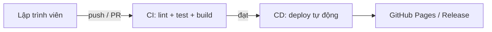
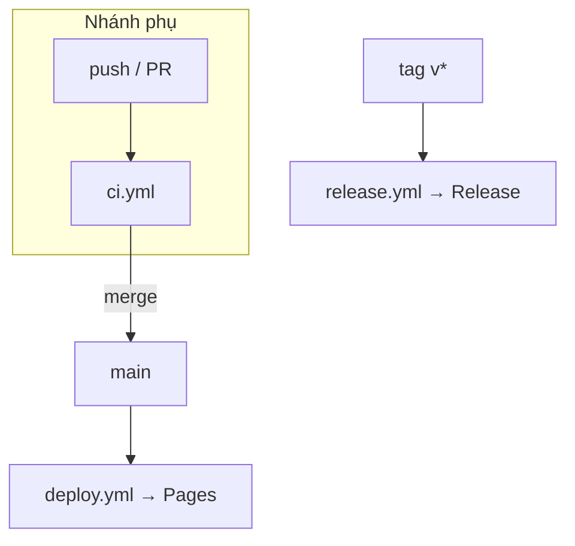

# 📚 Knowledge: CI/CD & Giải thích các Workflow

Tài liệu lý thuyết đi kèm với [tutorial.md](tutorial.md). Mục tiêu: hiểu **CI/CD là gì**, **GitHub Actions hoạt động thế nào**, và **3 file workflow trong repo này làm gì**.

---

## 1. CI/CD là gì?

### CI — Continuous Integration (Tích hợp liên tục)
Mỗi khi có thay đổi code, hệ thống **tự động** kiểm tra: cài dependencies, chạy **lint**, **test**, **build**. Mục tiêu là phát hiện lỗi *sớm*, giữ cho nhánh chính luôn ở trạng thái "chạy được".

### CD — Continuous Delivery / Deployment
- **Continuous Delivery:** code sau khi qua CI luôn *sẵn sàng* để phát hành (thường bấm 1 nút để deploy).
- **Continuous Deployment:** đi xa hơn — cứ qua CI là **tự động deploy** lên môi trường thật, không cần thao tác tay.

Repo này áp dụng **Continuous Deployment**: merge vào `main` là tự động deploy lên GitHub Pages.

### Vì sao cần CI/CD?
- 🐞 Bắt lỗi sớm, giảm rủi ro.
- 🤖 Tự động hóa việc lặp đi lặp lại (test, build, deploy).
- 🚀 Phát hành nhanh và ổn định.
- 👀 Minh bạch: ai cũng thấy trạng thái build/test qua các "check".



---

## 2. Khái niệm GitHub Actions cần biết

| Thuật ngữ | Ý nghĩa |
| --- | --- |
| **Workflow** | Một quy trình tự động, viết bằng YAML, đặt trong `.github/workflows/`. |
| **Event / Trigger** | Sự kiện kích hoạt workflow: `push`, `pull_request`, `push tags`, `workflow_dispatch`… |
| **Job** | Một nhóm công việc chạy trên cùng một máy ảo. Nhiều job có thể chạy song song hoặc phụ thuộc nhau (`needs`). |
| **Step** | Một bước trong job — hoặc chạy lệnh (`run`) hoặc gọi một action (`uses`). |
| **Runner** | Máy ảo chạy job (ở đây là `ubuntu-latest` do GitHub cung cấp). |
| **Action** | Khối tái sử dụng, ví dụ `actions/checkout@v4`, `actions/setup-node@v4`. |
| **Artifact** | Sản phẩm sinh ra (bản build, file zip) để lưu/chuyển giữa các job. |
| **Permissions** | Quyền cấp cho `GITHUB_TOKEN` của workflow (đọc/ghi repo, ghi Pages…). |
| **Concurrency** | Nhóm chạy đồng thời; dùng để hủy các run cũ khi có run mới. |
| **Cache** | Lưu lại thư mục (vd npm cache) để lần sau chạy nhanh hơn. |

Cấu trúc tối giản của một workflow:

```yaml
name: Tên hiển thị
on: [sự kiện kích hoạt]
jobs:
  ten-job:
    runs-on: ubuntu-latest
    steps:
      - uses: actions/checkout@v4   # gọi 1 action
      - run: npm ci                 # chạy 1 lệnh
```

---

## 3. Giải thích `ci.yml` — Continuous Integration

📄 File: [.github/workflows/ci.yml](.github/workflows/ci.yml)

**Nhiệm vụ:** kiểm tra chất lượng code trên mọi nhánh phụ và mọi Pull Request vào `main`. Đây là "người gác cổng" giữ cho `main` luôn sạch.

### Trigger
```yaml
on:
  push:
    branches-ignore:
      - main          # chạy khi push lên MỌI nhánh, TRỪ main
  pull_request:
    branches:
      - main          # chạy khi mở/ cập nhật PR nhắm vào main
```
- Push lên `main` **không** kích hoạt CI ở đây (vì đã có deploy lo phần đó).
- Đây là lý do khi làm lab bạn thấy CI chạy 2 lần: 1 lần do `push` nhánh, 1 lần do `pull_request`.

### Concurrency
```yaml
concurrency:
  group: ci-${{ github.ref }}
  cancel-in-progress: true
```
Nếu bạn push liên tiếp nhiều commit lên cùng nhánh, run CI cũ sẽ bị **hủy** để chỉ chạy commit mới nhất → tiết kiệm thời gian & tài nguyên.

### Job & Steps
```yaml
jobs:
  build-test:
    runs-on: ubuntu-latest
    steps:
      - uses: actions/checkout@v4          # 1. lấy code về runner
      - uses: actions/setup-node@v4        # 2. cài Node 20 + bật cache npm
        with:
          node-version: 20
          cache: npm
      - run: npm ci                        # 3. cài dependencies (sạch, theo lock)
      - run: npm run lint                  # 4. kiểm tra code style (ESLint)
      - run: npm run test:ci               # 5. unit test headless (chạy 1 lần)
      - run: npm run build                 # 6. build production để chắc chắn build được
```
- **`npm ci`** (khác `npm install`): cài đúng theo `package-lock.json`, phù hợp cho CI vì nhất quán.
- Thứ tự **lint → test → build** giúp lỗi rẻ nhất (style) bị bắt trước lỗi đắt nhất (build).

---

## 4. Giải thích `deploy.yml` — Continuous Deployment

📄 File: [.github/workflows/deploy.yml](.github/workflows/deploy.yml)

**Nhiệm vụ:** khi code vào `main`, tự động build và **deploy lên GitHub Pages**.

### Trigger
```yaml
on:
  push:
    branches:
      - main            # chạy khi có commit mới trên main (tức là sau khi merge PR)
  workflow_dispatch:    # cho phép bấm chạy tay từ tab Actions
```

### Permissions (quan trọng cho Pages)
```yaml
permissions:
  contents: read
  pages: write          # quyền publish lên Pages
  id-token: write       # cấp OIDC token để xác thực deploy an toàn
```
GitHub Pages "phiên bản Actions" dùng **OIDC** (OpenID Connect) thay vì đẩy vào nhánh `gh-pages` — an toàn hơn, không cần token thủ công.

### Job `build`
```yaml
- run: npm ci
- run: |
    npm run lint
    npm run test:ci
- run: npm run build -- --base-href="/${{ github.event.repository.name }}/"
```
- Vẫn **lint + test** lại trước khi deploy (an toàn).
- **`--base-href`**: app Angular chạy tại `https://<user>.github.io/<repo>/` (có tiền tố tên repo). `base-href` phải bằng `/<tên-repo>/` để các đường dẫn asset (JS/CSS) trỏ đúng. `${{ github.event.repository.name }}` tự lấy tên repo → không cần sửa tay.

```yaml
- run: |
    cp dist/todo-app/browser/index.html dist/todo-app/browser/404.html
    touch dist/todo-app/browser/.nojekyll
```
- **`404.html`**: đây là **SPA fallback**. App Angular là Single Page Application; khi người dùng F5 ở một route con, GitHub Pages tìm file tương ứng không thấy → trả 404. Copy `index.html` thành `404.html` để mọi đường dẫn đều nạp lại app.
- **`.nojekyll`**: tắt bộ xử lý Jekyll của GitHub Pages (nếu không, các thư mục/tệp bắt đầu bằng `_` có thể bị bỏ qua).

```yaml
- uses: actions/upload-pages-artifact@v3
  with:
    path: dist/todo-app/browser     # thư mục output của Angular
```
Đóng gói thư mục build thành artifact để job `deploy` dùng.

### Job `deploy`
```yaml
deploy:
  needs: build                      # chờ job build xong
  environment:
    name: github-pages
    url: ${{ steps.deployment.outputs.page_url }}   # in ra URL live
  steps:
    - uses: actions/deploy-pages@v4 # publish artifact lên Pages
```
- **`needs: build`**: tách 2 job (build rồi mới deploy) cho rõ ràng.
- **`environment: github-pages`**: gắn với môi trường Pages, và trả về **URL** hiển thị ngay trong Actions.

---

## 5. Giải thích `release.yml` — Đóng gói & phát hành phiên bản

📄 File: [.github/workflows/release.yml](.github/workflows/release.yml)

**Nhiệm vụ:** khi push một **tag phiên bản** (`vX.Y.Z`), build lại, đóng gói `.zip`, và tạo **GitHub Release** kèm ghi chú tự động.

### Trigger
```yaml
on:
  push:
    tags:
      - 'v*.*.*'        # chỉ chạy với tag dạng semver: v1.0.0, v2.3.1...
```
**Semantic Versioning (semver):** `vMAJOR.MINOR.PATCH`
- `MAJOR`: thay đổi phá vỡ tương thích.
- `MINOR`: thêm tính năng, vẫn tương thích.
- `PATCH`: sửa lỗi nhỏ.

### Permissions
```yaml
permissions:
  contents: write       # cần quyền GHI để tạo Release + upload file
```

### Steps chính
```yaml
- run: npm ci
- run: |
    npm run lint
    npm run test:ci
    npm run build -- --base-href="/${{ github.event.repository.name }}/"

- run: |
    cd dist/todo-app/browser
    zip -r "../../../flow-${{ github.ref_name }}.zip" .   # đóng gói build

- uses: softprops/action-gh-release@v2
  with:
    generate_release_notes: true      # tự sinh changelog từ commit/PR
    files: flow-${{ github.ref_name }}.zip   # đính kèm file zip vào Release
```
- **`github.ref_name`**: tên tag vừa push (vd `v1.0.0`) → dùng để đặt tên file zip.
- **`generate_release_notes`**: GitHub tự tổng hợp ghi chú phát hành từ các commit/PR kể từ release trước.
- **`softprops/action-gh-release`**: action phổ biến để tạo/cập nhật Release và upload asset.

> Lưu ý: nếu bạn tạo Release qua **UI** (Draft a new release), việc publish cũng tạo tag → vẫn kích hoạt workflow này; action sẽ **cập nhật** đúng release cùng tag và đính kèm file zip.

---

## 6. Bảng tổng hợp 3 workflow

| File | Kích hoạt khi | Làm gì | Kết quả |
| --- | --- | --- | --- |
| **ci.yml** | push nhánh ≠ `main`, hoặc PR vào `main` | lint + test + build | ✅ Check xanh/đỏ trên PR |
| **deploy.yml** | push vào `main` (sau merge PR) | build + tối ưu Pages + deploy | 🌐 App live trên GitHub Pages |
| **release.yml** | push tag `vX.Y.Z` | build + zip + tạo Release | 📦 GitHub Release + file `.zip` |



---

## 7. Glossary nhanh

- **Pipeline:** chuỗi các bước tự động (CI → CD).
- **Runner:** máy ảo chạy workflow.
- **Artifact:** file sản phẩm được lưu/chuyển giữa các job.
- **OIDC:** cơ chế xác thực token ngắn hạn, an toàn (dùng cho deploy Pages).
- **base-href:** đường dẫn gốc app dùng để tính link asset.
- **SPA fallback (404.html):** đảm bảo reload ở route con vẫn nạp đúng app.
- **Semver:** quy ước đánh số phiên bản `MAJOR.MINOR.PATCH`.
- **Branch protection:** luật bảo vệ nhánh (vd bắt buộc PR + check pass mới được merge vào `main`).

---

👉 Sẵn sàng thực hành? Mở [tutorial.md](tutorial.md) và làm theo từng bước.
