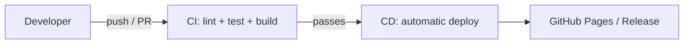
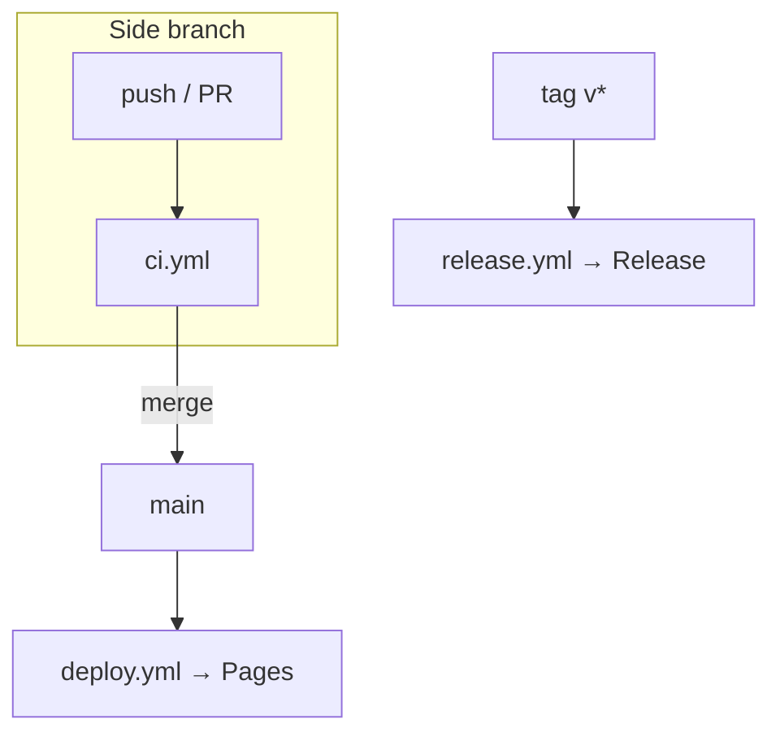

# 📚 Knowledge: CI/CD & Explaining the Workflows

Theory document that accompanies [tutorial.md](tutorial.md). Goal: understand **what CI/CD is**, **how GitHub Actions works**, and **what the 3 workflow files in this repo do**.

---

## 1. What is CI/CD?

### CI — Continuous Integration
Every time the code changes, the system **automatically** checks it: install dependencies, run **lint**, **test**, and **build**. The goal is to catch bugs *early* and keep the main branch always in a "working" state.

### CD — Continuous Delivery / Deployment
- **Continuous Delivery:** after passing CI, the code is always *ready* to be released (usually a single button press to deploy).
- **Continuous Deployment:** goes further — anything that passes CI is **deployed automatically** to the real environment, with no manual action.

This repo uses **Continuous Deployment**: merging into `main` automatically deploys to GitHub Pages.

### Why do we need CI/CD?
- 🐞 Catch bugs early, reduce risk.
- 🤖 Automate repetitive work (test, build, deploy).
- 🚀 Ship fast and reliably.
- 👀 Transparency: everyone can see the build/test status through the "checks".



---

## 2. GitHub Actions concepts to know

| Term | Meaning |
| --- | --- |
| **Workflow** | An automated process, written in YAML, placed in `.github/workflows/`. |
| **Event / Trigger** | The event that starts a workflow: `push`, `pull_request`, `push tags`, `workflow_dispatch`… |
| **Job** | A group of work that runs on the same virtual machine. Multiple jobs can run in parallel or depend on each other (`needs`). |
| **Step** | A step within a job — either runs a command (`run`) or calls an action (`uses`). |
| **Runner** | The virtual machine that runs a job (here it is `ubuntu-latest`, provided by GitHub). |
| **Action** | A reusable block, e.g. `actions/checkout@v4`, `actions/setup-node@v4`. |
| **Artifact** | An output produced (a build, a zip file) to store or pass between jobs. |
| **Permissions** | The permissions granted to the workflow's `GITHUB_TOKEN` (read/write repo, write Pages…). |
| **Concurrency** | A concurrency group; used to cancel older runs when a new one starts. |
| **Cache** | Stores a directory (e.g. the npm cache) so future runs are faster. |

Minimal structure of a workflow:

```yaml
name: Display name
on: [triggering event]
jobs:
  job-name:
    runs-on: ubuntu-latest
    steps:
      - uses: actions/checkout@v4   # call an action
      - run: npm ci                 # run a command
```

---

## 3. Explaining `ci.yml` — Continuous Integration

📄 File: [.github/workflows/ci.yml](.github/workflows/ci.yml)

**Purpose:** check code quality on every side branch and every Pull Request into `main`. This is the "gatekeeper" that keeps `main` clean.

### Trigger
```yaml
on:
  push:
    branches-ignore:
      - main          # runs when pushing to ANY branch EXCEPT main
  pull_request:
    branches:
      - main          # runs when a PR targeting main is opened/updated
```
- Pushing to `main` does **not** trigger CI here (because the deploy workflow handles that).
- This is why, during the lab, you see CI run twice: once from the branch `push`, and once from the `pull_request`.

### Concurrency
```yaml
concurrency:
  group: ci-${{ github.ref }}
  cancel-in-progress: true
```
If you push several commits in a row to the same branch, the older CI run is **cancelled** so only the newest commit runs → saves time and resources.

### Job & Steps
```yaml
jobs:
  build-test:
    runs-on: ubuntu-latest
    steps:
      - uses: actions/checkout@v4          # 1. pull the code onto the runner
      - uses: actions/setup-node@v4        # 2. install Node 20 + enable npm cache
        with:
          node-version: 20
          cache: npm
      - run: npm ci                        # 3. install dependencies (clean, per lockfile)
      - run: npm run lint                  # 4. check code style (ESLint)
      - run: npm run test:ci               # 5. unit test headless (run once)
      - run: npm run build                 # 6. production build to ensure it builds
```
- **`npm ci`** (different from `npm install`): installs exactly per `package-lock.json`, ideal for CI because it is consistent.
- The order **lint → test → build** catches the cheapest error (style) before the most expensive one (build).

---

## 4. Explaining `deploy.yml` — Continuous Deployment

📄 File: [.github/workflows/deploy.yml](.github/workflows/deploy.yml)

**Purpose:** when code lands on `main`, automatically build and **deploy to GitHub Pages**.

### Trigger
```yaml
on:
  push:
    branches:
      - main            # runs when there is a new commit on main (i.e. after merging a PR)
  workflow_dispatch:    # allows manual triggering from the Actions tab
```

### Permissions (important for Pages)
```yaml
permissions:
  contents: read
  pages: write          # permission to publish to Pages
  id-token: write       # grants an OIDC token for secure deploy authentication
```
The "Actions version" of GitHub Pages uses **OIDC** (OpenID Connect) instead of pushing to a `gh-pages` branch — safer, with no manual token needed.

### Job `build`
```yaml
- run: npm ci
- run: |
    npm run lint
    npm run test:ci
- run: npm run build -- --base-href="/${{ github.event.repository.name }}/"
```
- Still **lint + test** again before deploying (for safety).
- **`--base-href`**: the Angular app runs at `https://<user>.github.io/<repo>/` (with the repo name prefix). `base-href` must equal `/<repo-name>/` so asset paths (JS/CSS) point correctly. `${{ github.event.repository.name }}` picks up the repo name automatically → no manual edits.

```yaml
- run: |
    cp dist/todo-app/browser/index.html dist/todo-app/browser/404.html
    touch dist/todo-app/browser/.nojekyll
```
- **`404.html`**: this is the **SPA fallback**. The Angular app is a Single Page Application; when a user refreshes on a sub-route, GitHub Pages looks for a matching file, doesn't find it → returns 404. Copying `index.html` to `404.html` makes every path reload the app.
- **`.nojekyll`**: disables GitHub Pages' Jekyll processor (otherwise, folders/files starting with `_` may be ignored).

```yaml
- uses: actions/upload-pages-artifact@v3
  with:
    path: dist/todo-app/browser     # Angular's output directory
```
Packages the build directory into an artifact for the `deploy` job to use.

### Job `deploy`
```yaml
deploy:
  needs: build                      # waits for the build job to finish
  environment:
    name: github-pages
    url: ${{ steps.deployment.outputs.page_url }}   # prints the live URL
  steps:
    - uses: actions/deploy-pages@v4 # publishes the artifact to Pages
```
- **`needs: build`**: splits into two jobs (build first, then deploy) for clarity.
- **`environment: github-pages`**: ties it to the Pages environment and returns the **URL** displayed right in Actions.

---

## 5. Explaining `release.yml` — Packaging & publishing a version

📄 File: [.github/workflows/release.yml](.github/workflows/release.yml)

**Purpose:** when a **version tag** (`vX.Y.Z`) is pushed, rebuild, package a `.zip`, and create a **GitHub Release** with automatically generated notes.

### Trigger
```yaml
on:
  push:
    tags:
      - 'v*.*.*'        # only runs for semver-style tags: v1.0.0, v2.3.1...
```
**Semantic Versioning (semver):** `vMAJOR.MINOR.PATCH`
- `MAJOR`: breaking, backward-incompatible changes.
- `MINOR`: adds features, still compatible.
- `PATCH`: small bug fixes.

### Permissions
```yaml
permissions:
  contents: write       # needs WRITE permission to create a Release + upload files
```

### Main steps
```yaml
- run: npm ci
- run: |
    npm run lint
    npm run test:ci
    npm run build -- --base-href="/${{ github.event.repository.name }}/"

- run: |
    cd dist/todo-app/browser
    zip -r "../../../flow-${{ github.ref_name }}.zip" .   # package the build

- uses: softprops/action-gh-release@v2
  with:
    generate_release_notes: true      # auto-generate a changelog from commits/PRs
    files: flow-${{ github.ref_name }}.zip   # attach the zip file to the Release
```
- **`github.ref_name`**: the name of the tag just pushed (e.g. `v1.0.0`) → used to name the zip file.
- **`generate_release_notes`**: GitHub automatically compiles release notes from commits/PRs since the previous release.
- **`softprops/action-gh-release`**: a popular action to create/update a Release and upload assets.

> Note: if you create a Release through the **UI** (Draft a new release), publishing also creates a tag → this still triggers this workflow; the action will **update** the correct release with the same tag and attach the zip file.

---

## 6. Summary of the 3 workflows

| File | Triggered when | What it does | Result |
| --- | --- | --- | --- |
| **ci.yml** | push to a branch ≠ `main`, or a PR into `main` | lint + test + build | ✅ Green/red check on the PR |
| **deploy.yml** | push to `main` (after merging a PR) | build + optimize for Pages + deploy | 🌐 App live on GitHub Pages |
| **release.yml** | push a `vX.Y.Z` tag | build + zip + create a Release | 📦 GitHub Release + `.zip` file |



---

## 7. Quick glossary

- **Pipeline:** the chain of automated steps (CI → CD).
- **Runner:** the virtual machine that runs a workflow.
- **Artifact:** an output file stored/passed between jobs.
- **OIDC:** a mechanism for short-lived, secure token authentication (used for Pages deploy).
- **base-href:** the app's base path used to compute asset links.
- **SPA fallback (404.html):** ensures a reload on a sub-route still loads the app correctly.
- **Semver:** the versioning convention `MAJOR.MINOR.PATCH`.
- **Branch protection:** rules that protect a branch (e.g. requiring a PR + passing checks before merging into `main`).

---

👉 Ready to practice? Open [tutorial.md](tutorial.md) and follow the steps one by one.
