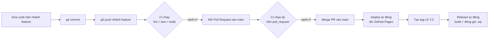

# 🧪 Tutorial: Tái hiện quy trình CI/CD từ Commit đến Release

> Bài lab thực hành. Học viên sẽ đi qua trọn vẹn một vòng đời CI/CD:
> **sửa code → commit → tạo nhánh → mở Pull Request → merge vào `main` → deploy tự động → tạo tag/release.**
>
> ⚠️ **Quy tắc bắt buộc của bài lab:** KHÔNG commit/merge thẳng vào `main`.
> Mọi thay đổi phải đi qua một **nhánh riêng** rồi **merge vào `main` bằng Pull Request**.

---

## 🎯 Sơ đồ luồng bạn sắp thực hiện



---

## 0. Yêu cầu trước khi bắt đầu

| Cần có | Ghi chú |
| --- | --- |
| **Node.js 20+** | Kiểm tra: `node -v` |
| **Git** | Kiểm tra: `git --version` |
| **Tài khoản GitHub** | Có quyền tạo repo/PR |
| **Repo đã ở trên GitHub** | Đã push nhánh `main` lên `origin` |

Clone repo về máy (nếu chưa có):

```powershell
git clone https://github.com/<username>/Github-CI-CD-Example.git
cd Github-CI-CD-Example
```

---

## 1. Chạy thử ứng dụng ở máy local

```powershell
npm install       # cài dependencies
npm start         # mở http://localhost:4200
```

Chạy thử đúng các lệnh mà **CI sẽ chạy trên GitHub** để chắc chắn code "sạch" trước khi push:

```powershell
npm run lint      # kiểm tra code style
npm run test:ci   # chạy unit test (headless Chrome, chạy 1 lần)
npm run build     # build production
```

> 💡 **Nguyên tắc vàng:** thứ gì fail ở local thì cũng sẽ fail trên CI. Luôn chạy 3 lệnh trên trước khi push để không phải chờ CI báo đỏ.

---

## 2. Cấu hình 1 lần trên GitHub (giảng viên hoặc học viên tự làm)

### 2.1 Bật GitHub Pages
1. Vào repo → **Settings** (thanh tab của repo) → **Pages** (mục *Code and automation*).
2. **Build and deployment → Source** → chọn **`GitHub Actions`**.

### 2.2 (Khuyến nghị) Bật Branch protection để "ép" merge qua PR
Đây là bước giúp thực thi đúng quy tắc "không merge thẳng vào `main`":

1. Vào repo → **Settings → Branches → Add branch ruleset** (hoặc *Branch protection rules*).
2. **Branch name pattern:** `main`
3. Bật các mục:
   - ✅ **Require a pull request before merging**
   - ✅ **Require status checks to pass before merging** → chọn check **`Lint, test & build`**
   - ✅ **Do not allow bypassing the above settings**
4. **Save changes**.

> Sau bước này, GitHub sẽ **chặn** mọi lần `git push` thẳng lên `main` — bắt buộc phải qua Pull Request.

---

## 3. Tạo nhánh làm việc (feature branch)

Luôn xuất phát từ `main` mới nhất:

```powershell
git checkout main
git pull origin main
git checkout -b feature/doi-tieu-de
```

> Quy ước tên nhánh: `feature/...`, `fix/...`, `chore/...`.

---

## 4. Thực hiện một thay đổi nhỏ

Ví dụ mở `src/index.html` và đổi tiêu đề trang, hoặc `src/app/app.html` đổi dòng slogan `Stay on top of your day`. Bất kỳ thay đổi nhỏ nào cũng được — mục tiêu là để thấy pipeline chạy.

Kiểm tra lại ở local:

```powershell
npm run lint
npm run test:ci
```

---

## 5. Commit thay đổi

```powershell
git add .
git commit -m "feat: doi tieu de trang chu"
```

> Gợi ý format commit (Conventional Commits): `feat:`, `fix:`, `docs:`, `chore:`, `refactor:`.

---

## 6. Push nhánh feature → CI chạy lần 1 (sự kiện `push`)

```powershell
git push -u origin feature/doi-tieu-de
```

Vào repo → tab **Actions**. Bạn sẽ thấy workflow **CI** chạy với sự kiện **push** (vì bạn push lên nhánh khác `main`).
Nó chạy: `npm ci` → **lint → test → build**.

---

## 7. Mở Pull Request vào `main` → CI chạy lần 2 (sự kiện `pull_request`)

1. Trên GitHub, bấm **Compare & pull request** (hoặc **Pull requests → New pull request**).
2. **base:** `main`  ←  **compare:** `feature/doi-tieu-de`.
3. Đặt tiêu đề, mô tả → **Create pull request**.

Trong trang PR, phần **checks** sẽ hiện workflow **CI / Lint, test & build (pull_request)** đang chạy.

> Vì sao chạy 2 lần? Cấu hình lắng nghe cả `push` (trên nhánh) và `pull_request` (vào `main`). Đây là hành vi bình thường.

---

## 8. Chờ check xanh rồi **Merge PR vào `main`**

1. Đợi tất cả check chuyển sang ✅ (nếu đỏ → xem log, sửa, commit & push lại vào cùng nhánh; PR tự cập nhật).
2. Bấm **Merge pull request** → **Confirm merge**.
3. (Tùy chọn) **Delete branch** để dọn dẹp.

> 🚫 **Nhắc lại:** đây là điểm mấu chốt của bài lab — code chỉ vào `main` **thông qua PR**, không bao giờ `git push origin main` trực tiếp.

---

## 9. Deploy tự động lên GitHub Pages (phần CD)

Ngay khi PR được merge vào `main`, workflow **Deploy to GitHub Pages** tự kích hoạt.

1. Vào tab **Actions** → mở run **"Deploy to GitHub Pages"**.
2. Chờ 2 job **Build** và **Deploy** xong (✅).
3. Mở app đã deploy tại:
   ```
   https://<username>.github.io/Github-CI-CD-Example/
   ```
   (Link cũng hiện trong job **Deploy** và ở **Settings → Pages**.)

> Nếu job deploy đỏ vì lỗi quyền Pages → quay lại **bước 2.1** bật Source = *GitHub Actions*.

---

## 10. Tạo Tag để phát hành Release (phần Release)

Tag `vX.Y.Z` sẽ kích hoạt workflow **Release**: build lại, đóng gói app thành file `.zip`, và tạo **GitHub Release** kèm changelog tự động.

### Cách A — Bằng dòng lệnh
```powershell
git checkout main
git pull origin main
git tag v1.0.0
git push origin v1.0.0
```

### Cách B — Bằng giao diện GitHub (không cần lệnh)
1. Repo → **Releases** → **Draft a new release**.
2. **Choose a tag** → gõ `v1.0.0` → **Create new tag: v1.0.0 on publish**.
3. **Target:** `main` → **Publish release**.

Sau đó vào **Actions** xem job **"Release"** chạy, rồi vào **Releases** sẽ thấy file `flow-v1.0.0.zip` được đính kèm.

---

## ✅ Checklist hoàn thành

- [ ] Chạy được app ở local (`npm start`)
- [ ] `npm run lint` / `test:ci` / `build` đều pass ở local
- [ ] Tạo nhánh feature từ `main`
- [ ] Commit + push nhánh → **CI (push)** chạy
- [ ] Mở PR vào `main` → **CI (pull_request)** chạy
- [ ] Merge PR (KHÔNG merge thẳng) → **Deploy** chạy
- [ ] Mở được URL GitHub Pages
- [ ] Push tag `v1.0.0` → **Release** chạy và có file `.zip`

---

## 🛠️ Troubleshooting thường gặp

| Triệu chứng | Nguyên nhân & cách xử lý |
| --- | --- |
| CI đỏ ở bước **Lint** | Chạy `npm run lint` ở local, sửa lỗi, commit lại. |
| CI đỏ ở bước **test** | Chạy `npm run test:ci`, xem test nào fail. |
| Job **Deploy** đỏ (Pages) | Chưa bật **Settings → Pages → Source = GitHub Actions** (bước 2.1). |
| Trang Pages trắng / lỗi asset | `--base-href` phải khớp tên repo — workflow tự xử lý; kiểm tra tên repo đúng. |
| Không push được lên `main` | Đúng như mong muốn (branch protection). Hãy tạo nhánh + PR. |
| Release không chạy | Tag phải đúng dạng `vX.Y.Z` (vd `v1.0.0`), và phải được **push** lên remote. |

---

📚 Muốn hiểu **tại sao** mỗi bước tồn tại và các file workflow viết gì? Đọc tiếp [knowledge.md](knowledge.md).
