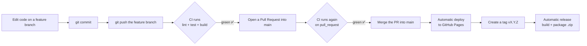

# 🧪 Tutorial: Reproducing the CI/CD flow from Commit to Release

> A hands-on lab. You will go through a complete CI/CD lifecycle:
> **edit code → commit → create a branch → open a Pull Request → merge into `main` → automatic deploy → create a tag/release.**
>
> ⚠️ **Mandatory rule of this lab:** DO NOT commit/merge directly into `main`.
> Every change must go through a **separate branch** and then **merge into `main` via a Pull Request**.

---

## 🎯 The flow you are about to perform



---

## 0. Prerequisites

| Required | Note |
| --- | --- |
| **Node.js 20+** | Check: `node -v` |
| **Git** | Check: `git --version` |
| **A GitHub account** | With permission to create repos/PRs |
| **Repo already on GitHub** | The `main` branch has been pushed to `origin` |

Clone the repo (if you don't have it yet):

```powershell
git clone https://github.com/<username>/Github-CI-CD-Example.git
cd Github-CI-CD-Example
```

---

## 1. Run the app locally

```powershell
npm install       # install dependencies
npm start         # open http://localhost:4200
```

Run exactly the same commands that **CI will run on GitHub** to make sure the code is "clean" before pushing:

```powershell
npm run lint      # check code style
npm run test:ci   # run unit tests (headless Chrome, run once)
npm run build     # production build
```

> 💡 **Golden rule:** whatever fails locally will also fail on CI. Always run the 3 commands above before pushing so you don't have to wait for CI to report red.

---

## 2. One-time GitHub setup (instructor or student does it)

### 2.1 Enable GitHub Pages
1. Go to the repo → **Settings** (the repo's tab bar) → **Pages** (under *Code and automation*).
2. **Build and deployment → Source** → choose **`GitHub Actions`**.

### 2.2 (Recommended) Enable Branch protection to "force" merging via PR
This step helps enforce the "no direct merge into `main`" rule:

1. Go to the repo → **Settings → Branches → Add branch ruleset** (or *Branch protection rules*).
2. **Branch name pattern:** `main`
3. Enable these options:
   - ✅ **Require a pull request before merging**
   - ✅ **Require status checks to pass before merging** → select the **`Lint, test & build`** check
   - ✅ **Do not allow bypassing the above settings**
4. **Save changes**.

> After this step, GitHub will **block** any `git push` directly to `main` — everything must go through a Pull Request.

---

## 3. Create a working branch (feature branch)

Always start from the latest `main`:

```powershell
git checkout main
git pull origin main
git checkout -b feature/change-title
```

> Branch naming convention: `feature/...`, `fix/...`, `chore/...`.

---

## 4. Make a small change

For example, open `src/index.html` and change the page title, or edit `src/app/app.html` and change the slogan `Stay on top of your day`. Any small change works — the goal is to see the pipeline run.

Verify locally:

```powershell
npm run lint
npm run test:ci
```

---

## 5. Commit the change

```powershell
git add .
git commit -m "feat: change home page title"
```

> Suggested commit format (Conventional Commits): `feat:`, `fix:`, `docs:`, `chore:`, `refactor:`.

---

## 6. Push the feature branch → CI runs the 1st time (the `push` event)

```powershell
git push -u origin feature/change-title
```

Go to the repo → the **Actions** tab. You will see the **CI** workflow run with the **push** event (because you pushed to a branch other than `main`).
It runs: `npm ci` → **lint → test → build**.

---

## 7. Open a Pull Request into `main` → CI runs the 2nd time (the `pull_request` event)

1. On GitHub, click **Compare & pull request** (or **Pull requests → New pull request**).
2. **base:** `main`  ←  **compare:** `feature/change-title`.
3. Set a title and description → **Create pull request**.

On the PR page, the **checks** section will show the workflow **CI / Lint, test & build (pull_request)** running.

> Why does it run twice? The configuration listens to both `push` (on the branch) and `pull_request` (into `main`). This is normal behavior.

---

## 8. Wait for the checks to go green, then **Merge the PR into `main`**

1. Wait for all checks to turn ✅ (if red → check the logs, fix, commit & push again to the same branch; the PR updates automatically).
2. Click **Merge pull request** → **Confirm merge**.
3. (Optional) **Delete branch** to clean up.

> 🚫 **Reminder:** this is the key point of the lab — code only enters `main` **through a PR**, never with a direct `git push origin main`.

---

## 9. Automatic deploy to GitHub Pages (the CD part)

As soon as the PR is merged into `main`, the **Deploy to GitHub Pages** workflow triggers automatically.

1. Go to the **Actions** tab → open the **"Deploy to GitHub Pages"** run.
2. Wait for the two jobs **Build** and **Deploy** to finish (✅).
3. Open the deployed app at:
   ```
   https://<username>.github.io/Github-CI-CD-Example/
   ```
   (The link also appears in the **Deploy** job and under **Settings → Pages**.)

> If the deploy job is red due to a Pages permission error → go back to **step 2.1** and set Source = *GitHub Actions*.

---

## 10. Create a Tag to publish a Release (the Release part)

A `vX.Y.Z` tag triggers the **Release** workflow: it rebuilds, packages the app into a `.zip` file, and creates a **GitHub Release** with an automatic changelog.

### Option A — Using the command line
```powershell
git checkout main
git pull origin main
git tag v1.0.0
git push origin v1.0.0
```

### Option B — Using the GitHub UI (no commands needed)
1. Repo → **Releases** → **Draft a new release**.
2. **Choose a tag** → type `v1.0.0` → **Create new tag: v1.0.0 on publish**.
3. **Target:** `main` → **Publish release**.

Then go to **Actions** to watch the **"Release"** job run, and in **Releases** you will see the `flow-v1.0.0.zip` file attached.

---

## ✅ Completion checklist

- [ ] Ran the app locally (`npm start`)
- [ ] `npm run lint` / `test:ci` / `build` all pass locally
- [ ] Created a feature branch from `main`
- [ ] Commit + push the branch → **CI (push)** runs
- [ ] Open a PR into `main` → **CI (pull_request)** runs
- [ ] Merge the PR (NOT a direct merge) → **Deploy** runs
- [ ] Opened the GitHub Pages URL
- [ ] Push tag `v1.0.0` → **Release** runs and produces a `.zip` file

---

## 🛠️ Common troubleshooting

| Symptom | Cause & fix |
| --- | --- |
| CI red at the **Lint** step | Run `npm run lint` locally, fix the errors, commit again. |
| CI red at the **test** step | Run `npm run test:ci` and see which test fails. |
| **Deploy** job red (Pages) | You haven't enabled **Settings → Pages → Source = GitHub Actions** (step 2.1). |
| Pages page is blank / asset errors | `--base-href` must match the repo name — the workflow handles this; check that the repo name is correct. |
| Cannot push to `main` | This is expected (branch protection). Create a branch + PR. |
| Release doesn't run | The tag must match the `vX.Y.Z` format (e.g. `v1.0.0`) and must be **pushed** to the remote. |

---

📚 Want to understand **why** each step exists and what the workflow files contain? Continue reading [knowledge.md](knowledge.md).
